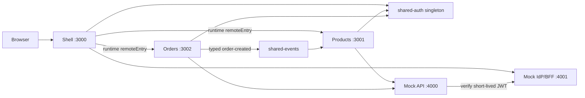

# Architecture

The shell owns global chrome, top-level routes, authentication bootstrap, login/logout, lazy remote loading and remote error boundaries. Remotes own their feature routes, UI, API orchestration and domain state. The shell does not reach into a remote's internal route tree.

Navigation and selected entity IDs belong in URLs. Search and fetched domain data remain local to Products; order state remains local to Orders. There is deliberately no global Redux store. The narrow `order-created` event is a typed cross-domain notification, not a hidden data store.

Build-time sharing is ordinary workspace/package reuse: TypeScript compiles imports against package contracts. Runtime Module Federation is different: separately deployed JavaScript containers negotiate modules in the browser. React, React DOM, React Router and `shared-auth` are singleton shares so hooks, router context and auth context have one identity. `requiredVersion` rejects/warns on incompatible ranges (depending on federation runtime behavior); CI should update host and remote ranges together. A breaking shared contract requires a major version and coordinated rollout or an adapter.

Remote URLs are read from Vite environment configuration. Deploy a new compatible remote bundle at the configured stable origin without rebuilding the shell. If the URL itself changes, update deployment configuration and rebuild/promote only the shell configuration artifact; mature deployments commonly inject a runtime manifest to avoid even that step.
