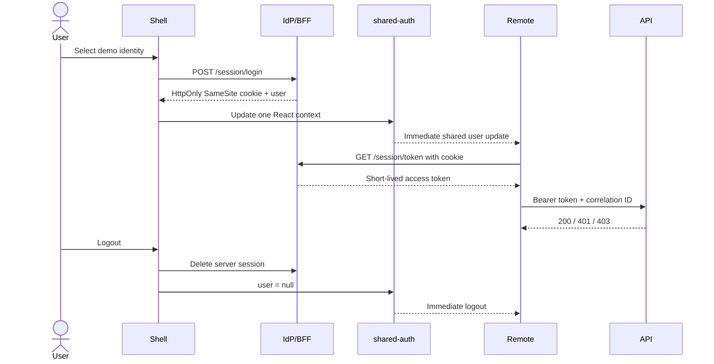

# Authentication and session flow

Only the shell creates `AuthProvider`; federation ensures remotes import that same package instance. Remotes request tokens through `getAccessToken()` and never receive them through props, URLs or events. A 401 triggers session recovery; a 403 routes to `/unauthorized`.

Production uses OIDC Authorization Code Flow with PKCE. Prefer a BFF that exchanges the code, stores refresh/access tokens server-side, and exposes only a Secure, HttpOnly, SameSite session cookie. `localStorage` is readable by injected JavaScript, so an XSS can exfiltrate long-lived credentials. The demo returns a five-minute token to memory solely to make API mechanics visible.
