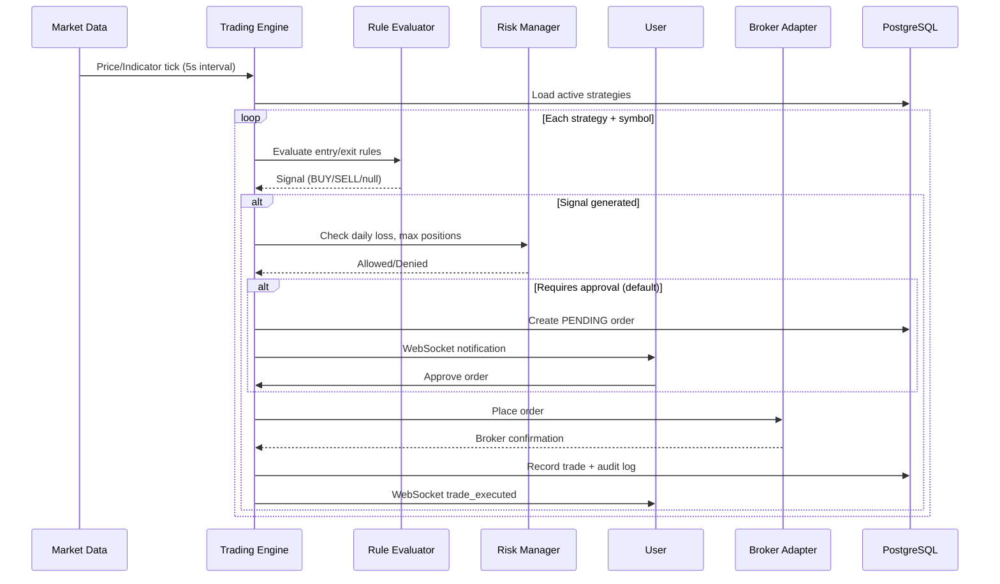

# SmartTrade India - System Architecture

## Overview

SmartTrade India is a production-grade monorepo for NSE/BSE stock trading with automated execution, built as a modular system ready for microservice extraction.

```
smarttrade-india/
├── frontend/                 # React 18 + TypeScript + Vite + MUI + Zustand
├── backend/                  # Node.js + Express + TypeScript
│   └── src/
│       ├── brokers/          # Pluggable broker adapters
│       ├── engine/           # Rule evaluator + trading engine
│       ├── routes/           # REST API routes
│       ├── services/         # Business logic
│       ├── websocket/        # Real-time WebSocket server
│       └── middleware/       # Auth, rate limiting, errors
├── packages/shared/          # Shared TypeScript types
├── database/migrations/      # PostgreSQL schema
├── docker/                   # Dockerfiles + nginx config
└── docs/                     # Architecture, API, deployment
```

## Microservice-Ready Decomposition

| Service | Responsibility | Current Location |
|---------|---------------|------------------|
| API Gateway | Routing, rate limiting, auth | `backend/src/index.ts` |
| Auth Service | JWT, 2FA, sessions | `backend/src/services/authService.ts` |
| Market Service | Quotes, indices, scanner | `backend/src/services/marketService.ts` |
| Trading Engine | Rule evaluation, order execution | `backend/src/engine/` |
| Broker Adapter | Zerodha, Upstox, Angel One, ICICI | `backend/src/brokers/` |
| Notification Service | Email, SMS, Telegram alerts | Future: BullMQ workers |
| Analytics Service | P&L, backtesting metrics | `backend/src/services/strategyService.ts` |

## Automated Trading Workflow



## Compliance Layer

1. **No trades without authorization** — `requires_manual_approval` defaults to `true`; `REQUIRE_ORDER_APPROVAL=true` env enforces globally
2. **Broker consent flow** — `is_consent_given` must be true before broker connection
3. **Emergency stop** — Halts all strategies, disables auto-trading, broadcasts via WebSocket
4. **Audit logging** — Every login, order, strategy change, and emergency stop is logged
5. **Risk warnings** — Displayed on login, registration, and broker connection
6. **Encrypted API keys** — AES-256-GCM encryption at rest

## State Management (Frontend)

| Store | Purpose |
|-------|---------|
| `useAuthStore` | User session, JWT tokens (persisted) |
| `useMarketStore` | Dashboard data, live quotes |
| `useTradingStore` | Risk settings, emergency stop state |
| `useThemeStore` | Dark/light mode (persisted) |
| `useWSStore` | WebSocket connection + real-time events |

## WebSocket Architecture

- **Endpoint**: `ws://host/ws?token=<JWT>`
- **Events**: `quote_update`, `order_update`, `trade_executed`, `signal_generated`, `alert`, `emergency_stop`, `portfolio_update`
- **Pattern**: User-scoped broadcast via `broadcastToUser(userId, message)`

## Broker Adapter Pattern

```typescript
interface BrokerAdapter {
  connect(credentials): Promise<void>;
  placeOrder(order): Promise<{ brokerOrderId }>;
  modifyOrder(id, updates): Promise<void>;
  cancelOrder(id): Promise<void>;
  getHoldings(): Promise<BrokerHoldings[]>;
  getPositions(): Promise<BrokerHoldings[]>;
  getMargins(): Promise<BrokerMargin>;
}
```

Implementations: Zerodha, Upstox, Angel One, ICICI Direct (Groww planned).

## Sample Strategy

**RSI + EMA + Volume Strategy** (`backend/src/engine/ruleEvaluator.ts`):

- **BUY when**: RSI < 30 AND Volume > 2x average AND Price above 20 EMA
- **SELL when**: RSI > 70 OR Stop loss hit OR Target reached
- **Risk**: 2% stop loss, 4% target, 10% position size

Create via API: `POST /api/trading/strategies/sample`

## Security

- JWT access (15m) + refresh (7d) tokens
- bcrypt password hashing (12 rounds)
- TOTP 2FA via speakeasy
- Rate limiting: global (100/15min), auth (10/15min), orders (30/min)
- Helmet security headers
- Role-based access: admin, trader, viewer, analyst
